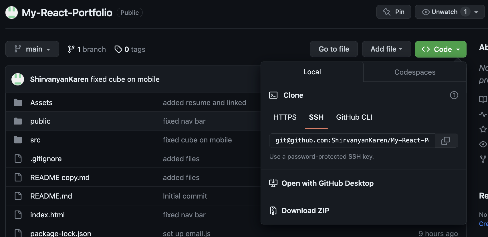

# My-React-Portfolio

## Technology used
| Technology Used and Deployed App       | Resource URL           | 
| ------------- |:-------------:| 
| Deployed Application  | [https://pwa-text-editor-shirvanyank-d70c3e71dd6c.herokuapp.com/](https://pwa-text-editor-shirvanyank-d70c3e71dd6c.herokuapp.com/) |
| My Repository      | [https://github.com/ShirvanyanKaren/PWA-Text-Editor](https://github.com/ShirvanyanKaren/PWA-Text-Editor) |
|  Vite | [https://vitejs.dev/](https://vitejs.dev/) |
| React | [https://developer.chrome.com/docs/workbox/#injectmanifest_plugin](https://developer.chrome.com/docs/workbox/#injectmanifest_plugin) |
| sass  | [https://www.npmjs.com/package/nodemon](https://www.npmjs.com/package/nodemon) |
|  Animate.css | [https://animate.style/#documentation](https://animate.style/#documentation) |
| particlests  | [https://particles.js.org/docs/](https://particles.js.org/docs/) |
| emailjs  | [https://www.emailjs.com/docs/](https://www.emailjs.com/docs/) |
| Git | [https://git-scm.com/](https://git-scm.com/)     | 


# Description

This project involved using react and vite to build a portfolio showcasing my resume, portfolio, a contact page, and a section about myself. The project involved implementing my past projects and qualifications while concurrently showcasing my capacity as a developer to create an adequate portfolio page.

The application had to meet the following acceptance criteria:

```md
GIVEN a single-page application portfolio for a web developer
WHEN I load the portfolio
THEN I am presented with a page containing a header, a section for content, and a footer
WHEN I view the header
THEN I am presented with the developer's name and navigation with titles corresponding to different sections of the portfolio
WHEN I view the navigation titles
THEN I am presented with the titles About Me, Portfolio, Contact, and Resume, and the title corresponding to the current section is highlighted
WHEN I click on a navigation title
THEN the browser URL changes and I am presented with the corresponding section below the navigation and that title is highlighted
WHEN I load the portfolio the first time
THEN the About Me title and section are selected by default
WHEN I am presented with the About Me section
THEN I see a recent photo or avatar of the developer and a short bio about them
WHEN I am presented with the Portfolio section
THEN I see titled images of six of the developer’s applications with links to both the deployed applications and the corresponding GitHub repositories
WHEN I am presented with the Contact section
THEN I see a contact form with fields for a name, an email address, and a message
WHEN I move my cursor out of one of the form fields without entering text
THEN I receive a notification that this field is required
WHEN I enter text into the email address field
THEN I receive a notification if I have entered an invalid email address
WHEN I am presented with the Resume section
THEN I see a link to a downloadable resume and a list of the developer’s proficiencies
WHEN I view the footer
THEN I am presented with text or icon links to the developer’s GitHub and LinkedIn profiles, and their profile on a third platform (Stack Overflow, Twitter)
```


Here is an example of how the application runs:


## Table of Contents
* [React](#react)
* [Vite] (#vite)
* [Installation](#installation)
* [Usage](#usage)
* [License](#license)
* [Questions](#questions) 


## React

React enables a developer to concurrently use html and css styling with javascript code and logic seemlessly. Components are one part of this formula that enables a developer to render preset jsx/js code containing stylings and functionality on different pages. Below is the App.jsx file that renders these components on all pages with outlet being the prefined routes specified in the main.jsx file. 


```jsx
import "./style/App.scss";
import Nav from "./components/Nav/Nav";
import { Outlet } from "react-router-dom";
import AppPar from "./components/Particles/Particles";


function App() {
  return (
    <>
      <div className="App">
        <AppPar className="particles" />
        <Nav />
        <Outlet />
      </div>
    </>
  );
}

export default App;

```

React also utilizes within these page rendering functions such as useEffect and useState. The example below demonstates how usestate is used to to set different class names to the nav bar with the initial value of false. This logic is utilized for the hamburger menu to hide the other elements on the navbar using the onClick event handler.

```jsx
const Navbar = () => {
  const currentPage = useLocation().pathname;
  const [isMenuOpen, setIsMenuOpen] = useState(false);

  const toggleMenu = () => {
    setIsMenuOpen(!isMenuOpen);
  };

  return (
    <div className={`nav-bar${isMenuOpen ? ' open' : ''}`}>
      <nav>
        <NavLink exact="true" className={currentPage === '/' ? 'about-active' : 'about-link'} to="/">
          <FontAwesomeIcon icon={faHomeUser} color="#4d4d4e" />
        </NavLink>
...

        <div className="burger-nav" onClick={toggleMenu}>
          <div className={`burger-menu${isMenuOpen ? ' open' : ''}`}>
            <div className="burger-bar"></div>
            <div className="burger-bar"></div>
            <div className="burger-bar"></div>
          </div>
        </div>
      </nav>
    </div>
  );
};

```


## Vite

Vite is a tool for building web applications that supports many different JavaScript frameworks including React. In the following example, vite is configurated using the defineConfig function. Within this function, react is listed as a plugin enabling react accesibility to the server.

```js
import { defineConfig } from 'vite'
import react from '@vitejs/plugin-react'


export default defineConfig({
  plugins: [react()],
  server: {
    port: 3301,
    open: true
  }
})

```


## Installation

For installation

1. Clone the repository from github


2. Choose the location of the repository and run gitclone 

``` bash
git clone git@github.com:ShirvanyanKaren/My-React-Portfolio.git
 ```

 3. Make sure to run the npm install to get all the packages
```bash
npm install
```

## Usage

This portfolio can be used for future emloyers to gauge an applicants capacity as a devloper. The page includes and About Me page, Portfolio page, Resume page, and a Contact page that sends emails via emailjs. 


## License 
     
MIT licensing with permisions such as commercial use, modification, distribution and private use. Limitations include liability and warranty.

## Questions 

* Check out my other projects on my [my Github](https://github.com/ShirvanyanKaren)
* For any additional questions or concerns, please email me at kshirvanyan2000@gmail.com